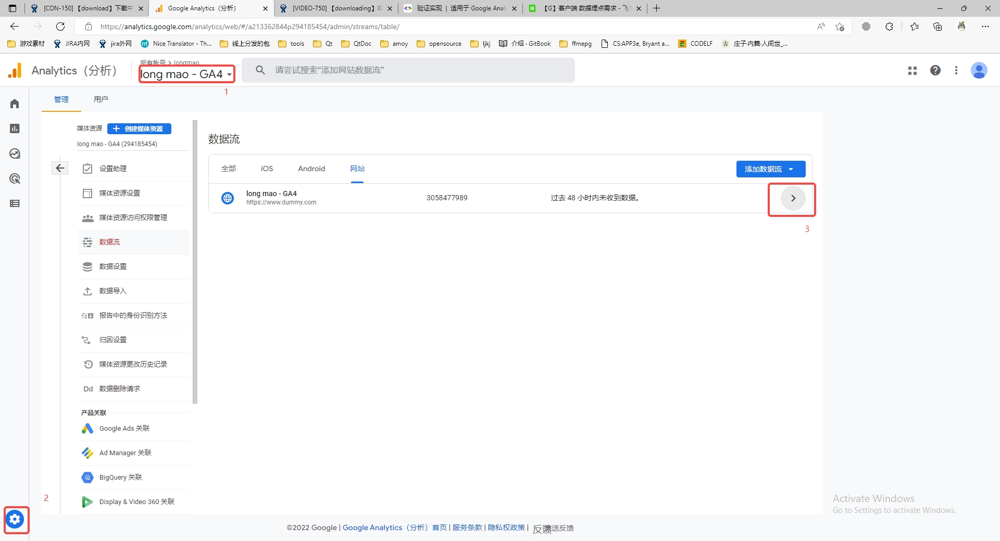
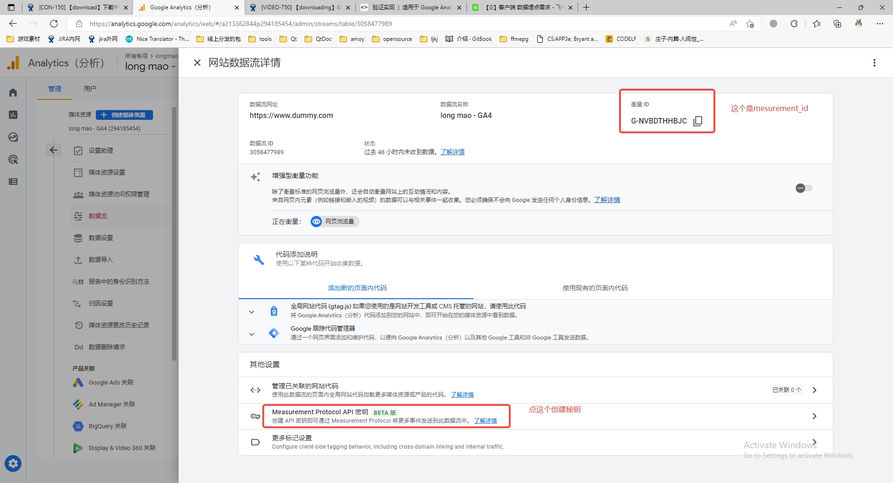
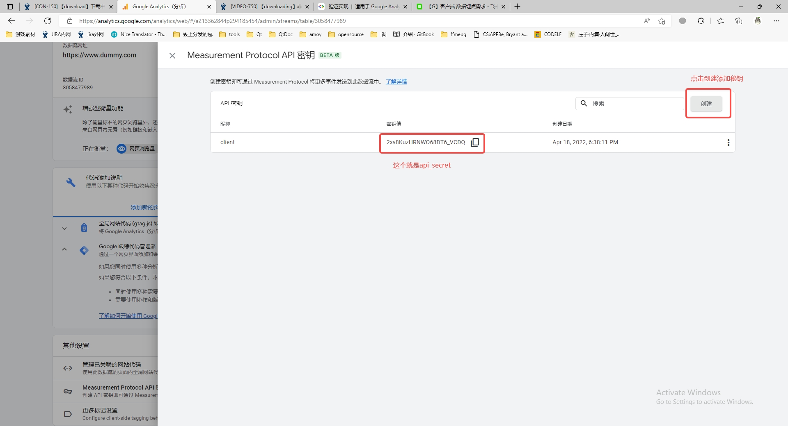
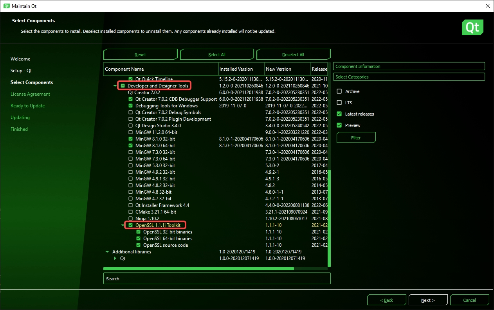

# Qt Google GA4

用于 `QWidget`项目发送 `GA4` 事件

## 原理

通过 Measurement Protocol 发送请求，注意参数格式要符合需求。错误的参数格式回返回 http 200 但是看不到数据。
<https://developers.google.com/analytics/devguides/collection/protocol/ga4/verify-implementation?client_type=gtag>

```js
const measurementId = `<measurement_id_value>`;
const apiSecret = `<secret_value>`;

fetch(`https://www.google-analytics.com/mp/collect?measurement_id=${measurementId}&api_secret=${apiSecret}`, {
  method: "POST",
  body: JSON.stringify({
    "client_id": "XXXXXXXXXX.YYYYYYYYYY",
    "events": [{
      "name": "refund",
      "params": {
        "currency": "USD",
        "value": "9.99",
        "transaction_id": "ABC-123"
      }
    }]
  })
});
```

## 如何使用

1. .pro 文件添加 QT += network
2. 拷贝 `ganalytics` 目录到你的工程中，并将目录下的4个文件添加到工程中.
3. 在`main`方法中，在主窗口显示前，初始化GA
4. 项目中，需要发送`GA`时候，调用全局单例 `ga->sendEvent("eventName")` 即可
5. 运行时，需要将对应的`openssl`动态库拷贝到应用程序目录下

```
#include "ganalytics/ganalytics.h"
#include <QUuid>

#define GA_MEASUREMENT_ID  "YOUR_MEASUREMENT_ID" // 这个填你自己的MesurementId
#define GA_API_SECRET  "YOUR_API_SECRET"         // 这个填你自己的Api Secret


int main(int argc, char *argv[])
{
    ...

    // Init GA
    QString clientID; // 从配置中读取clientID
    if (clientID.isEmpty()) {
        clientID = QUuid::createUuid().toString();
        // 这个clientID，需要保存在配置(存sqlite数据库或者QSetting)中，作为客户端唯一的标识。
    }
    ga->setClientID(clientID);
    ga->setMeasurementId(GA_MEASUREMENT_ID);
    ga->setApiSecret(GA_API_SECRET);
    ga->enable(true);
    ga->setSendInterval(3000);
    ga->setLogLevel(GAnalytics::Debug);

    // Now you can send event by name.
    ga->sendEvent("eventName");
    // Or
    ga->sendEvent("cateGory", "eventName", "eventParamName", "eventParamValue");

    ...
}


```

## 如何配置 MesurementId 和 Api Secret

1.


2.


3.


## 错误处理

如果出现 `qt.network.ssl: QSslSocket::connectToHostEncrypted: TLS initialization failed`

需要拷贝对应Qt版本的ssl到应用程序目录下

```
#include <QSslSocket>
#include <QNetworkAccessManager>

// 查詢Qt支持ssl的版本
bool bSupp = QSslSocket::supportsSsl();
QString buildVersion = QSslSocket::sslLibraryBuildVersionString();
QString version = QSslSocket::sslLibraryVersionString();
qDebug() << bSupp << buildVersion << version;
```

### Qt安装openssl

`Qt5.15.2` 以上可以用 `MaintenanceTool.exe` 安装


#### 安装后的目录

windows

32位版本 `C:\Qt\Tools\OpenSSL\Win_x86\bin`
32位版本 `C:\Qt\Tools\OpenSSL\Win_x64\bin`

## 参考实现

GA官方文档：
<https://developers.google.com/analytics/devguides/collection/protocol/ga4/verify-implementation?client_type=gtag>

旧版GA的Qt实现：

<https://github.com/HSAnet/qt-google-analytics>
<https://github.com/MultiMC/Launcher/tree/develop/libraries/ganalytics>

新版GA的Python实现：
<https://github.com/adswerve/GA4-Measurement-Protocol-Python>
